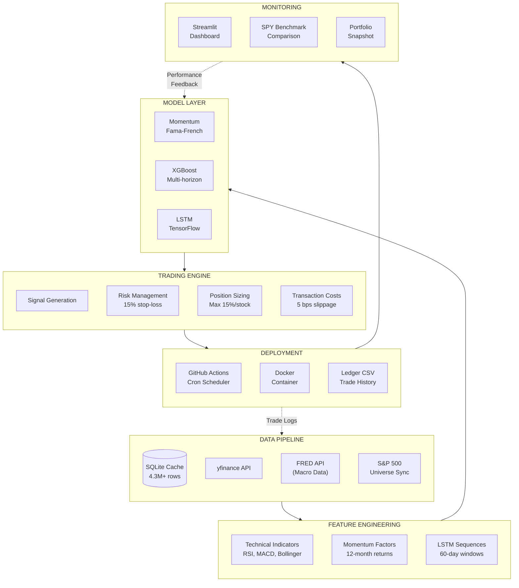
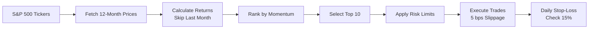
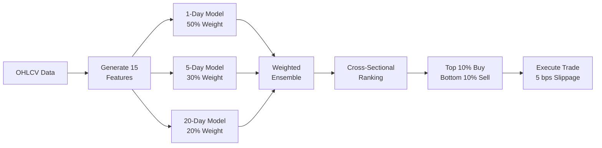

# Paper Trader AI


**Paper Trader AI** is a production-grade algorithmic trading system featuring a **Triple Portfolio Architecture** that runs three independent strategies simultaneously for performance comparison.

### [View Live Portfolio Dashboard](https://paper-trader-ai.streamlit.app/)
> Real-time portfolio values, performance charts with SPY benchmark, and trade history updated daily.

---

## Triple Portfolio System

| Portfolio | Strategy | Schedule | Ledger |
|-----------|----------|----------|--------|
| **Momentum** | 12-month momentum + 15% stop-loss | Monthly (1st trading day) | `ledger_momentum.csv` |
| **ML** | XGBoost ensemble predictions | Daily (weekdays) | `ledger_ml.csv` |
| **LSTM** | TensorFlow neural network | Daily (weekdays) | `ledger_lstm.csv` |

### Performance With Transaction Costs (Oct 1 - Dec 19, 2025)

| Metric | Momentum | ML Ensemble | LSTM | SPY |
|--------|----------|-------------|------|-----|
| **Return** | +7.20% | +1.58% | +1.59% | +2.12% |
| **Excess vs SPY** | +5.08% | -0.54% | -0.53% | — |
| **Total Trades** | 50 | 526 | 134 | — |
| **Slippage** | 5 bps | 5 bps | 5 bps | — |

> All strategies include realistic transaction costs (5 basis points slippage on all trades).

---

## Quick Start

```bash
# Clone and setup
git clone https://github.com/PAT0216/paper-trader.git
cd paper-trader

# Run momentum strategy
python main.py --strategy momentum --portfolio momentum

# Run ML strategy
python main.py --strategy ml --portfolio ml

# Launch comparison dashboard
cd dashboard && streamlit run app.py
```

---

## Features

### Modular Strategy Architecture (NEW)
- **BaseStrategy** abstract class for consistent interface
- **Strategy Registry** with factory pattern
- Add new strategies without modifying main.py:
  ```python
  from src.strategies import get_strategy
  strategy = get_strategy("momentum")  # or "ml"
  ```

### Momentum Strategy (Primary)
- **12-month momentum factor** with Fama-French methodology
- **15% daily stop-loss** for downside protection
- **Monthly rebalancing** on first trading day
- Top 10 stocks from S&P 500 universe

### ML Strategy (Experimental)
- **XGBoost Regressor** with 15 technical features
- **Multi-horizon ensemble** (1-day 50%, 5-day 30%, 20-day 20%)
- **Noise-based feature selection** (only features that beat random)
- Daily retraining and rebalancing

### Transaction Costs
- **5 basis points slippage** on all BUY and SELL trades
- Modeled via `TransactionCostModel` class
- Applied consistently in backtests and live trading

### Risk Management
- **Position limits**: Max 15% per stock, 30% per sector
- **Stop-loss**: 15% from entry price
- **Portfolio drawdown control**: Warning at -15%, halt at -20%, liquidate at -25%

### Infrastructure
- **SQLite data cache**: 4.3M+ rows, 503 S&P 500 tickers
- **GitHub Actions**: Automated trading + universe sync
- **Streamlit Dashboard**: Live comparison with SPY benchmark
- **Point-in-time Universe**: Monthly S&P 500 sync

---

## System Architecture



### Component Details

| Phase | Components | Purpose |
|-------|------------|---------|
| **Data Pipeline** | SQLite cache, yfinance, FRED | Collect & store market data |
| **Feature Engineering** | Technical indicators, momentum factors | Transform raw data for models |
| **Model Layer** | Momentum, XGBoost, LSTM | Generate trading signals |
| **Trading Engine** | Risk mgmt, position sizing, costs | Execute trades safely |
| **Deployment** | GitHub Actions, Docker | Automate daily operations |
| **Monitoring** | Streamlit dashboard | Track performance vs benchmark |

## Strategy Architecture

### Adding a New Strategy

```python
# 1. Create src/strategies/my_strategy.py
from src.strategies.base import BaseStrategy

class MyStrategy(BaseStrategy):
    def get_name(self): return "my_strategy"
    def needs_training(self): return False
    def rank_universe(self, data_dict): ...
    def generate_signals(self, data_dict): ...

# 2. Register in src/strategies/registry.py
STRATEGIES["my_strategy"] = MyStrategy

# Done! No main.py changes needed.
```

### Momentum Strategy Flow (Monthly)



### ML Ensemble Strategy Flow (Daily)



---

## GitHub Actions Workflows

| Workflow | Purpose | Schedule |
|----------|---------|----------|
| **Universe Refresh** | Update S&P 500 ticker list | 1st of month, 8 PM UTC |
| **Cache Refresh** | Update price data + snapshot | Daily, 9 PM UTC |
| **Momentum Strategy Trade** | Monthly momentum rebalance | 1st-3rd of month, 9:30 PM UTC |
| **ML Strategy Trade** | Daily ML predictions | Mon-Fri, 9:30 PM UTC |

Run manually: **Actions** > Select workflow > **Run workflow**

---

## Project Structure

```
paper-trader/
├── main.py                         # Core trading logic
├── config/
│   └── trading.yaml                # All configuration
├── src/
│   ├── strategies/                 # Strategy infrastructure
│   │   ├── base.py                 # BaseStrategy ABC
│   │   ├── momentum_strategy.py    # Momentum implementation
│   │   ├── ml_strategy.py          # ML implementation
│   │   └── registry.py             # Strategy factory
│   ├── models/                     # ML models (XGBoost)
│   ├── trading/                    # Portfolio & risk management
│   ├── features/                   # Technical indicators
│   ├── backtesting/                # Costs & performance metrics
│   └── data/                       # Data loading & caching
├── scripts/
│   ├── backtests/                  # Backtest scripts
│   ├── validation/                 # PIT validation scripts
│   └── utils/                      # Utility scripts
├── dashboard/
│   └── app.py                      # Streamlit dashboard
├── data/
│   ├── market.db                   # SQLite price cache
│   ├── portfolio_snapshot.json     # Dashboard metrics
│   └── spy_benchmark.json          # SPY chart data
├── .github/workflows/              # CI/CD automation
└── docs/                           # Documentation
```

---

## Documentation

| Document | Purpose |
|----------|---------|
| [COMPLETE_PROJECT_GUIDE.md](docs/COMPLETE_PROJECT_GUIDE.md) | Full system architecture |
| [MANUAL.md](docs/MANUAL.md) | Technical reference with all functions |
| [MOMENTUM_STRATEGY.md](docs/MOMENTUM_STRATEGY.md) | Momentum strategy details |
| [ML_STRATEGY.md](docs/ML_STRATEGY.md) | ML ensemble strategy details |

---

## Testing

```bash
# Run all tests
python -m pytest tests/ -v

# Run validation scripts
python scripts/validation/pit_momentum_oct_dec.py    # Momentum PIT backtest
python scripts/validation/pit_backtest_oct_dec.py   # ML PIT backtest
```

---

## Disclaimer

This is a **paper trading** system for educational purposes. Past performance does not guarantee future results. Do not trade real money based on this system.

---

## License

MIT License - See [LICENSE](LICENSE) for details.

---

*Built by Prabuddha Tamhane - December 2025*
