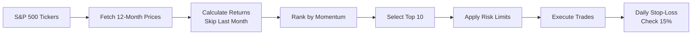
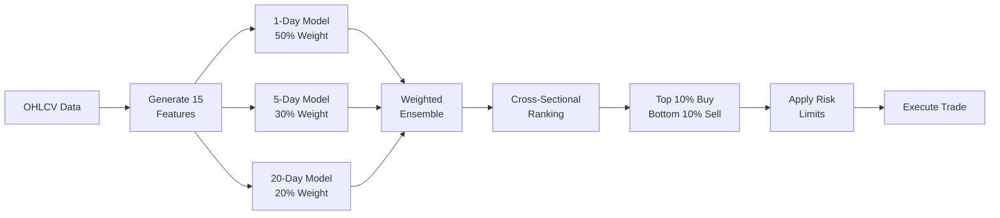

# Paper Trader AI


**Paper Trader AI** is a production-grade algorithmic trading system featuring a **Dual Portfolio Architecture** that runs two independent strategies simultaneously for performance comparison.

### 🔴 [View Live Portfolio Dashboard](https://paper-trader-ai.streamlit.app/)
> Real-time portfolio values, performance charts with SPY benchmark, and trade history updated daily.

---

## 🎯 Dual Portfolio System

| Portfolio | Strategy | Schedule | Ledger |
|-----------|----------|----------|--------|
| **Momentum** | 12-month momentum + 15% stop-loss | Monthly (1st trading day) | `ledger_momentum.csv` |
| **ML** | XGBoost ensemble predictions | Daily (weekdays) | `ledger_ml.csv` |

### Performance Summary

#### Momentum Strategy (2015-2025 Backtest)

| Metric | Momentum |
|--------|----------|
| **CAGR** | +25.6% |
| **Total Return** | +1,099% |
| **Sharpe Ratio** | 0.98 |
| **Max Drawdown** | -27% |

#### ML Strategy (Oct-Dec 2025 Live)

| Metric | ML Ensemble |
|--------|-------------|
| **Return** | +7.64% |
| **Alpha vs SPY** | +4.54% |
| **Sharpe Ratio** | 1.37 |

> Results use production risk management (15% stop-loss, position limits, drawdown controls).

---

## 🚀 Quick Start

```bash
# Clone and setup
git clone https://github.com/PAT0216/paper-trader.git
cd paper-trader

# Run momentum strategy
python main.py --strategy momentum --portfolio momentum

# Run ML strategy
python main.py --strategy ml --portfolio ml

# Launch comparison dashboard
cd dashboard && streamlit run app.py
```

---

## 📋 Features

### 📈 Momentum Strategy (Primary)
- **12-month momentum factor** with Fama-French methodology
- **15% daily stop-loss** for downside protection
- **Monthly rebalancing** on first trading day
- Top 10 stocks from S&P 500 universe

### 🤖 ML Strategy (Experimental)
- **XGBoost Regressor** with 15 technical features
- **Multi-horizon ensemble** (1-day 50%, 5-day 30%, 20-day 20%)
- **Noise-based feature selection** (only features that beat random)
- Daily retraining and rebalancing

### 🛡️ Risk Management
- **Position limits**: Max 15% per stock, 30% per sector
- **Stop-loss**: 15% from entry price
- **Portfolio drawdown control**: Warning at -15%, halt at -20%, liquidate at -25%

### 📦 Infrastructure
- **SQLite data cache**: 4.3M+ rows, 503 S&P 500 tickers
- **GitHub Actions**: Automated trading + universe sync
- **Streamlit Dashboard**: Live comparison with SPY benchmark
- **Point-in-time Universe**: Monthly S&P 500 sync

---

## 🏗️ Strategy Architecture

### Momentum Strategy (Monthly)



### ML Ensemble Strategy (Daily)



---

## 📊 GitHub Actions Workflows

| Workflow | Purpose | Schedule |
|----------|---------|----------|
| **Universe Refresh** | Update S&P 500 ticker list | 1st of month, 8 PM UTC |
| **Cache Refresh** | Update price data + snapshot | Daily, 9 PM UTC |
| **Momentum Strategy Trade** | Monthly momentum rebalance | 1st-3rd of month, 9:30 PM UTC |
| **ML Strategy Trade** | Daily ML predictions | Mon-Fri, 9:30 PM UTC |

Run manually: **Actions** → Select workflow → **Run workflow**

---

## 📁 Project Structure

```
paper-trader/
├── main.py                         # Core trading logic
├── config/
│   └── settings.yaml               # All configuration
├── src/
│   ├── strategies/                 # Momentum strategy
│   ├── models/                     # ML models (XGBoost)
│   ├── trading/                    # Portfolio & risk management
│   ├── features/                   # Technical indicators
│   └── data/                       # Data loading & caching
├── scripts/
│   ├── backtests/                  # Backtest scripts
│   ├── validation/                 # Validation scripts
│   └── utils/                      # Utility scripts
├── dashboard/
│   └── app.py                      # Streamlit dashboard
├── data/
│   ├── market.db                   # SQLite price cache
│   ├── portfolio_snapshot.json     # Dashboard metrics
│   └── spy_benchmark.json          # SPY chart data
├── .github/workflows/              # CI/CD automation
└── docs/                           # Documentation
```

---

## 📚 Documentation

| Document | Purpose |
|----------|---------|
| [COMPLETE_PROJECT_GUIDE.md](docs/COMPLETE_PROJECT_GUIDE.md) | Full system architecture |
| [MOMENTUM_STRATEGY.md](docs/MOMENTUM_STRATEGY.md) | Momentum strategy details |
| [MANUAL.md](docs/MANUAL.md) | Technical reference |
| [ML_ALIGNMENT_REPORT_2024-12-17.md](docs/ML_ALIGNMENT_REPORT_2024-12-17.md) | ML bug fixes & alignment |

---

## 🧪 Testing

```bash
# Run all tests
python -m pytest tests/ -v

# Run validation scripts
python scripts/validation/momentum_rebalance_comparison.py  # Monthly vs Weekly comparison
python scripts/validation/compare_ml_vs_momentum.py         # Strategy comparison
```

---

## ⚠️ Disclaimer

This is a **paper trading** system for educational purposes. Past performance does not guarantee future results. Do not trade real money based on this system.

---

## 📄 License

MIT License - See [LICENSE](LICENSE) for details.
