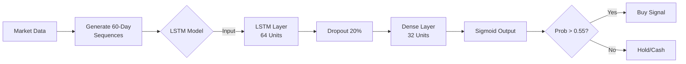
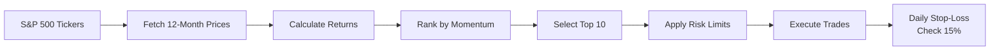

# Paper Trader AI


**Paper Trader AI** is a production-grade algorithmic trading system featuring a **Triple Portfolio Architecture** that runs three independent strategies simultaneously for performance comparison.

### [View Live Portfolio Dashboard](https://paper-trader-ai.streamlit.app/)
> Real-time portfolio values, performance charts with SPY benchmark, and trade history updated daily.

---

## Triple Portfolio System

| Portfolio | Strategy | Schedule | Ledger |
|-----------|----------|----------|--------|
| **Momentum** | 12-month momentum + 15% stop-loss | Monthly (1st trading day) | `data/ledgers/ledger_momentum.csv` |
| **ML** | XGBoost ensemble predictions | Daily (weekdays) | `data/ledgers/ledger_ml.csv` |
| **LSTM** | TensorFlow neural network | Daily (weekdays) | `data/ledgers/ledger_lstm.csv` |

### Live Performance (Oct 1, 2025 - Jan 26, 2026)

| Metric | Momentum | ML Ensemble | LSTM | SPY |
|--------|----------|-------------|------|-----|
| **Return** | +18.65% | +6.95% | +7.94% | +3.94% |
| **Sharpe Ratio** | 2.04 | 0.92 | 1.65 | 0.97 |
| **Max Drawdown** | -9.1% | -14.8% | -7.8% | -5.1% |
| **Excess vs SPY** | +14.71% | +3.01% | +4.00% | — |

> All strategies include realistic transaction costs (5 basis points slippage on all trades).

---

## Quick Start

```bash
# Clone and setup
git clone https://github.com/PAT0216/paper-trader.git
cd paper-trader

# Run momentum strategy
python main.py --strategy momentum --portfolio momentum

# Run ML strategy
python main.py --strategy ml --portfolio ml

# Launch comparison dashboard
cd dashboard && streamlit run app.py
```

---

## Docker Setup

Run Paper Trader in a containerized environment for consistent, reproducible execution.

### Prerequisites
- [Docker](https://docs.docker.com/get-docker/) installed
- [Docker Compose](https://docs.docker.com/compose/install/) (included with Docker Desktop)

### Build the Image

```bash
# Build the Docker image
docker build -t paper-trader .

# Or use Docker Compose
docker compose build
```

### Run with Docker Compose

```bash
# Start the trading bot (runs main.py by default)
docker compose up

# Run in background
docker compose up -d

# Stop containers
docker compose down
```

### Run Specific Strategies

```bash
# Run momentum strategy
docker run --rm -v $(pwd):/app paper-trader \
  conda run -n paper-trader python main.py --strategy momentum --portfolio momentum

# Run ML strategy
docker run --rm -v $(pwd):/app paper-trader \
  conda run -n paper-trader python main.py --strategy ml --portfolio ml

# Run LSTM strategy
docker run --rm -v $(pwd):/app paper-trader \
  conda run -n paper-trader python main.py --strategy lstm --portfolio lstm
```

### Run Tests in Docker

```bash
docker run --rm -v $(pwd):/app paper-trader \
  conda run -n paper-trader pytest tests/ -v
```

### Launch Dashboard

```bash
docker run --rm -p 8501:8501 -v $(pwd):/app paper-trader \
  conda run -n paper-trader streamlit run dashboard/app.py --server.address 0.0.0.0
```
Then open [http://localhost:8501](http://localhost:8501) in your browser.

---

## Features

### Modular Strategy Architecture (NEW)
- **BaseStrategy** abstract class for consistent interface
- **Strategy Registry** with factory pattern
- Add new strategies without modifying main.py:
  ```python
  from src.strategies import get_strategy
  strategy = get_strategy("momentum")  # or "ml"
  ```

### Momentum Strategy (Primary)
- **12-month momentum factor** with Fama-French methodology
- **15% daily stop-loss** for downside protection
- **Monthly rebalancing** on first trading day
- Top 10 stocks from S&P 500 universe

### ML Strategy (Experimental)
- **XGBoost Regressor** with 15 technical features
- **Multi-horizon ensemble** (1-day 50%, 5-day 30%, 20-day 20%)
- **Noise-based feature selection** (only features that beat random)
- Daily retraining and rebalancing

### Transaction Costs
- **5 basis points slippage** on all BUY and SELL trades
- Modeled via `TransactionCostModel` class
- Applied consistently in backtests and live trading

### Risk Management
- **Position limits**: Max 15% per stock, 30% per sector
- **Stop-loss**: 15% from entry price
- **Portfolio drawdown control**: Warning at -15%, halt at -20%, liquidate at -25%

### Infrastructure
- **SQLite data cache**: 4.3M+ rows, 503 S&P 500 tickers
- **GitHub Actions**: Automated trading + universe sync
- **Streamlit Dashboard**: Live comparison with SPY benchmark
- **Point-in-time Universe**: Monthly S&P 500 sync
- **AWS Lambda**: Serverless trading execution (see below)

---

## AWS Lambda Deployment

The trading system can run as a serverless Lambda function on AWS, providing cost-effective automated execution.

### Architecture

| Component | Service | Configuration |
|-----------|---------|---------------|
| **Compute** | AWS Lambda | 2048 MB, 15 min timeout |
| **Container** | ECR | `paper-trader:latest` |
| **Schedule** | EventBridge | 3 schedules (ML 4:30 PM, LSTM 4:35 PM, Momentum 1st-3rd) |
| **Storage** | S3 | `paper-trader-data-{user}` |
| **Version Control** | GitHub | Source of truth for ledgers |

### Data Flow

```
cache_refresh.yml -> S3 (market.db)
EventBridge -> Lambda -> downloads from S3 + GitHub
Lambda -> runs trading -> commits to GitHub -> uploads to S3
GitHub -> Dashboard auto-refreshes
```

### Environment Variables

| Variable | Description |
|----------|-------------|
| `AWS_REGION` | Lambda region (us-west-2) |
| `BUCKET_NAME` | S3 bucket for market data |
| `STRATEGY` | Trading strategy (momentum, ml, lstm) |
| `GITHUB_PAT` | GitHub token for commits |

### Build & Deploy

```bash
# Build Lambda container
docker build -f Dockerfile.lambda -t paper-trader .

# Push to ECR (automatic via aws-ecr-push.yml on push to main)
aws ecr get-login-password --region us-west-2 | docker login --username AWS --password-stdin <account>.dkr.ecr.us-west-2.amazonaws.com
docker tag paper-trader:latest <account>.dkr.ecr.us-west-2.amazonaws.com/paper-trader:latest
docker push <account>.dkr.ecr.us-west-2.amazonaws.com/paper-trader:latest
```

### EventBridge Scheduler Configuration

Three EventBridge schedules trigger Lambda for each strategy:

| Schedule Name | Cron (PT) | Days | Payload |
|---------------|-----------|------|---------|
| `paper-trader-daily-trigger` | 4:30 PM | Mon-Fri | `{"strategy": "ml"}` |
| `paper-trader-lstm` | 4:35 PM | Mon-Fri | `{"strategy": "lstm"}` |
| `paper-trader-momentum` | 4:30 PM | 1st-3rd | `{"strategy": "momentum"}` |

**Daily data refresh** via `cache_refresh.yml` (GitHub Actions) at 1:00 PM PT updates all ledger VALUES.

**To add/modify schedules:**
1. Go to: EventBridge > Schedules
2. Create/edit schedule with target `paper-trader-daily`
3. Set payload: `{"strategy": "<strategy_name>"}`

---

## MLOps System Architecture


### 1. Data Cycle (The Foundation)
- **Sources**: yfinance (OHLCV), FRED (Macroeconomic), S&P 500 Tickers
- **Processing**: Automated cleaners, split adjustments, macroeconomic normalization
- **Storage**: SQLite cache (local/container) + S3 Bucket (cloud persistence)

### 2. Strategy Engine (The Brains)
Three distinct algorithmic approaches running in parallel:

| Strategy | Logic | Rebalancing |
|----------|-------|-------------|
| **Momentum** | Classical Factor Investing (12-month returns + Relative Strength) | Monthly |
| **XGBoost** | Ensemble Learning (15 technical features, noise filtration) | Daily |
| **LSTM** | Deep Learning (60-day sequential patterns, TensorFlow) | Daily |

### 3. Execution & Deployment (The Muscle)
- **Serverless**: AWS Lambda handles compute, triggered by EventBridge schedules
- **CI/CD**: GitHub Actions automates testing, Docker builds, and universe synchronization
- **Ledger**: Git-based transaction recording ensures 100% auditability and transparency

---

## Strategy Deep Dive

### LSTM Neural Network Flow (Daily)



### Momentum Strategy Flow (Monthly)



### ML Ensemble Strategy Flow (Daily)


---

## GitHub Actions Workflows

| Workflow | Purpose | Schedule |
|----------|---------|----------|
| **Universe Refresh** | Update S&P 500 ticker list | 1st of month, 8 PM UTC |
| **Cache Refresh** | Update price data + snapshot | Daily, 9 PM UTC |
| **Momentum Strategy Trade** | Monthly momentum rebalance | 1st-3rd of month, 9:30 PM UTC |
| **ML Strategy Trade** | Daily ML predictions | Mon-Fri, 9:30 PM UTC |
| **LSTM Strategy Trade** | Daily LSTM predictions | Mon-Fri, 9:45 PM UTC |
| **Monthly Retrain** | Retrain LSTM model | 2nd of month, 10 PM UTC |

Run manually: **Actions** > Select workflow > **Run workflow**

---

## Project Structure

```
paper-trader/
├── main.py                         # Core trading logic
├── config/
│   ├── settings.yaml               # Main configuration
│   ├── momentum_config.yaml        # Momentum strategy settings
│   └── backtest_settings.yaml      # Backtest parameters
├── src/
│   ├── strategies/                 # Strategy implementations
│   │   ├── base.py                 # BaseStrategy ABC
│   │   ├── momentum_strategy.py    # Momentum (12-1 month)
│   │   ├── ml_strategy.py          # XGBoost ensemble
│   │   ├── lstm_strategy.py        # LSTM neural network
│   │   └── registry.py             # Strategy factory
│   ├── models/                     # ML models
│   │   ├── trainer.py              # XGBoost training
│   │   ├── training_utils.py       # Shared training utilities (NEW v2.0)
│   │   └── lstm/                   # LSTM model
│   ├── trading/                    # Portfolio & risk
│   │   ├── portfolio.py            # Ledger management
│   │   ├── ledger_utils.py         # Ledger utilities (NEW v2.0)
│   │   └── risk_manager.py         # Position sizing
│   ├── data/                       # Data layer
│   │   ├── loader.py               # Data fetching
│   │   ├── cache.py                # SQLite cache
│   │   └── price_utils.py          # Price utilities (NEW v2.0)
│   ├── features/                   # Technical indicators
│   └── backtesting/                # Backtest engine
├── scripts/
│   ├── utils/                      # Utility scripts
│   │   └── compute_portfolio_snapshot.py
│   └── simulate_production.py      # Production simulation (NEW v2.0)
├── dashboard/
│   └── app.py                      # Streamlit dashboard
├── data/
│   ├── ledgers/                    # Trade ledgers (NEW v2.0)
│   │   ├── ledger_ml.csv
│   │   ├── ledger_lstm.csv
│   │   └── ledger_momentum.csv
│   ├── snapshots/                  # Per-strategy snapshots
│   ├── market.db                   # SQLite price cache
│   └── portfolio_snapshot.json     # Consolidated metrics
├── tests/                          # Unit tests (75 tests)
├── .github/workflows/              # CI/CD automation
└── docs/                           # Documentation
```

---

## Documentation

| Document | Purpose |
|----------|---------|
| [COMPLETE_PROJECT_GUIDE.md](docs/COMPLETE_PROJECT_GUIDE.md) | Full system architecture |
| [MANUAL.md](docs/MANUAL.md) | Technical reference with all functions |
| [MOMENTUM_STRATEGY.md](docs/MOMENTUM_STRATEGY.md) | Momentum strategy details |
| [ML_STRATEGY.md](docs/ML_STRATEGY.md) | ML ensemble strategy details |

---

## Testing

```bash
# Run all tests
python -m pytest tests/ -v

# Run validation scripts
python scripts/validation/pit_momentum_oct_dec.py    # Momentum PIT backtest
python scripts/validation/pit_backtest_oct_dec.py   # ML PIT backtest
```

---

## Disclaimer

This is a **paper trading** system for educational purposes. Past performance does not guarantee future results. Do not trade real money based on this system.

---

## License

MIT License - See [LICENSE](LICENSE) for details.

---

*Built by Prabuddha Tamhane - v2.0.0 January 2026*
