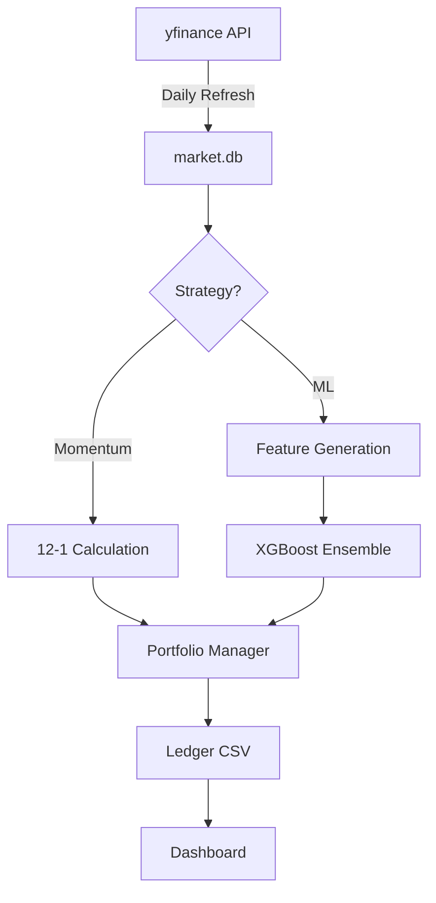

# Paper Trader AI - Complete Project Guide

> **Private Documentation** - Comprehensive guide to the entire system architecture.

---

## 🏗️ System Overview

Paper Trader AI is a **dual-portfolio algorithmic trading system** that:
1. Runs **two independent strategies** simultaneously (Momentum & ML)
2. Maintains **separate ledgers** for each strategy
3. Provides a **Streamlit dashboard** for real-time comparison
4. Automates trading via **GitHub Actions**

### 🔴 [Live Dashboard](https://paper-trader-ai.streamlit.app/)

---

## 🎯 Dual Portfolio Architecture

### Portfolio Isolation

| Portfolio | Strategy | Ledger | Workflow | Rebalance |
|-----------|----------|--------|----------|-----------|
| **Momentum** | 12-month momentum + 15% SL | `ledger_momentum.csv` | `momentum_trade.yml` | Monthly |
| **ML** | XGBoost ensemble | `ledger_ml.csv` | `ml_trade.yml` | Daily |

### Why Dual Portfolios?

1. **Fair comparison**: Same capital, same universe, different strategies
2. **No interference**: Momentum trades don't affect ML portfolio
3. **Performance tracking**: Clear attribution of returns
4. **Risk isolation**: One strategy failing doesn't affect the other

---

## 📈 Strategy 1: Momentum (Primary)

### Theory
- Based on Jegadeesh & Titman (1993) academic research
- Fama-French factor: stocks that went up keep going up
- 12-month lookback (skip last month to avoid reversal)

### Implementation
```python
# Monthly rebalance
1. Fetch 12-month returns for S&P 500
2. Skip last month (reversal effect)
3. Rank by momentum score
4. Buy top 10 stocks (equal weight)
5. Apply 15% stop-loss + position limits
```

### Performance (2015-2025 Backtest)

| Metric | Value |
|--------|-------|
| **CAGR** | +25.6% |

| **Sharpe Ratio** | 0.98 |
| **Max Drawdown** | -27% |

### Yearly Returns

| Year | Return |
|------|--------|
| 2015 | +18.4% |
| 2016 | -5.7% |
| 2017 | +42.6% |
| 2018 | +19.5% |
| 2019 | +16.1% |
| 2020 | +0.9% |
| 2021 | +31.7% |
| 2022 | +10.2% |
| 2023 | +21.4% |
| 2024 | +136.0% |
| 2025 | +29.5% |

---

## 🤖 Strategy 2: ML Ensemble

### Theory
- XGBoost predicts N-day returns (multi-horizon)
- 15 technical features (momentum, volume, volatility)
- Noise-based feature selection (only features better than random)

### Implementation
```python
# Daily trading
1. Generate 15 features from OHLCV
2. Train 3 models: 1-day (50%), 5-day (30%), 20-day (20%)
3. Weighted ensemble prediction
4. Rank stocks by predicted return
5. Buy top 10%, apply risk limits
```

### Performance (Oct 2025 - Dec 2025 PIT Backtest)

| Metric | Value |
|--------|-------|

| **Annualized** | +43.8% |
| **Sharpe Ratio** | 1.37 |
| **Max Drawdown** | -16.5% |
| **Alpha vs SPY** | +4.54% |

### Walk-Forward Validation (2017-2025)

| Metric | Value |
|--------|-------|
| **Final Value** | $667,664 (from $100k) |

| **CAGR** | +26.3% |
| **Sharpe Ratio** | 0.84 |
| **Max Drawdown** | -36.7% |
| **Win Rate** | 56.8% |

### ML Model Details

| Parameter | Value |
|-----------|-------|
| Algorithm | XGBoost Regressor |
| Horizons | 1d (50%), 5d (30%), 20d (20%) |
| Features | 15 technical indicators |
| Feature Selection | Noise-based (beat random features) |
| Retraining | Daily |
| Universe | S&P 500 |

---

## 📊 Feature Engineering (ML Strategy)

### 15 Production Features

| Category | Features |
|----------|----------|
| **Momentum** | RSI, MACD, MACD_signal, MACD_hist |
| **Trend** | BB_Width, Dist_SMA50, Dist_SMA200, Return_1d, Return_5d |
| **Volume** | OBV_Momentum, Volume_Ratio, VWAP_Dev |
| **Volatility** | ATR_Pct, BB_PctB, Vol_Ratio |

### Feature Selection Process
```python
1. Add 5 random noise features to training data
2. Train quick XGBoost model
3. Keep only features with importance > max(noise features)
4. Fallback: if none beat noise, keep top 8 by importance
5. Train final model on selected features only
```

---

## 🛡️ Risk Management

### Portfolio-Level Controls

| Level | Trigger | Action |
|-------|---------|--------|
| Warning | -15% drawdown | Reduce position sizes 50% |
| Halt | -20% drawdown | No new buys, sells only |
| Liquidate | -25% drawdown | Force sell 50% |

### Position-Level Controls

| Control | Value |
|---------|-------|
| Max position | 15% of portfolio |
| Max sector | 30% of portfolio |
| Stop-loss | 15% from entry |
| Slippage | 10 bps assumed |

---

## 📦 Data Infrastructure

### SQLite Cache

| Stat | Value |
|------|-------|
| Database | `data/market.db` |
| Tickers | 503 (S&P 500) |
| Total Rows | 4.3M+ |
| Date Range | 2010-2025 |

### Data Flow



---

## 🔄 GitHub Actions Workflows

| Workflow | Schedule | Purpose |
|----------|----------|---------|
| **Universe Refresh** | 1st of month, 8 PM UTC | Update S&P 500 list |
| **Cache Refresh** | Mon-Fri, 9 PM UTC | Update prices + compute snapshot |
| **Momentum Trade** | 1st-3rd of month, 9:30 PM UTC | Monthly rebalance |
| **ML Trade** | Mon-Fri, 9:30 PM UTC | Daily trading |

### Workflow Data Updates

The `cache_refresh.yml` workflow now updates:
- `data/market.db` - Price cache
- `data/portfolio_snapshot.json` - Dashboard metrics
- `data/spy_benchmark.json` - SPY chart data

---

## 📊 Streamlit Dashboard

### Features
- **Portfolio comparison**: Momentum vs ML vs SPY
- **Performance chart**: All 3 strategies with SPY benchmark
- **Holdings table**: Current positions per strategy
- **Trade history**: Recent trades

### URL: [paper-trader-ai.streamlit.app](https://paper-trader-ai.streamlit.app/)

---

## 📁 File Structure (Updated Dec 2025)

```
paper-trader/
├── main.py                              # Core orchestrator
├── config/
│   └── settings.yaml                    # All configuration
├── src/
│   ├── strategies/
│   │   └── momentum_strategy.py         # Momentum implementation
│   ├── models/
│   │   ├── trainer.py                   # XGBoost training + feature selection
│   │   └── predictor.py                 # Ensemble predictions
│   ├── trading/
│   │   ├── portfolio.py                 # Portfolio management
│   │   └── risk_manager.py              # Risk controls
│   ├── features/
│   │   └── indicators.py                # Feature generation
│   └── data/
│       ├── loader.py                    # Data fetching
│       └── cache.py                     # SQLite cache
├── scripts/
│   ├── backtests/                       # Backtest scripts
│   │   ├── run_backtest.py
│   │   ├── run_walkforward.py
│   │   ├── ml_walkforward.py
│   │   ├── momentum_backtest.py
│   │   └── momentum_vs_spy.py
│   ├── validation/                      # Validation scripts
│   │   ├── momentum_rebalance_comparison.py
│   │   ├── compare_ml_vs_momentum.py
│   │   ├── pit_backtest_oct_dec.py
│   │   └── validate_ml_trainer.py
│   └── utils/                           # Utility scripts
│       ├── compute_portfolio_snapshot.py
│       ├── update_universe.py
│       ├── fetch_fundamentals.py
│       └── backfill_ledgers.py
├── dashboard/
│   └── app.py                           # Streamlit app
├── .github/workflows/
│   ├── cache_refresh.yml                # Daily data refresh
│   ├── momentum_trade.yml               # Monthly momentum
│   ├── ml_trade.yml                     # Daily ML
│   └── universe_refresh.yml             # Monthly universe
├── data/
│   ├── market.db                        # SQLite cache
│   ├── sp500_tickers.txt                # Ticker list
│   ├── portfolio_snapshot.json          # Dashboard metrics
│   └── spy_benchmark.json               # SPY chart data
├── ledger_momentum.csv                  # Momentum trades
├── ledger_ml.csv                        # ML trades
├── results/                             # Backtest outputs
└── docs/                                # Documentation
```

---

## 🎯 CLI Reference

```bash
# Momentum strategy (isolated portfolio)
python main.py --strategy momentum --portfolio momentum

# ML strategy (isolated portfolio)
python main.py --strategy ml --portfolio ml

# Training only
python main.py --mode train --strategy ml

# Backtesting
python main.py --mode backtest --strategy momentum
```

### Arguments

| Arg | Options | Default |
|-----|---------|---------|
| `--strategy` | `momentum`, `ml` | `momentum` |
| `--portfolio` | any string | `default` |
| `--mode` | `trade`, `train`, `backtest` | `trade` |

---

## 🧪 Testing

```bash
# Run all tests
python -m pytest tests/ -v

# Specific validation scripts
python scripts/validation/momentum_rebalance_comparison.py
python scripts/validation/compare_ml_vs_momentum.py
```

---

## 🚀 Recent Updates (Dec 2025)

1. **ML Alignment**: Fixed critical bugs in target calculation and feature selection
2. **SPY Benchmark**: Added SPY line to performance chart
3. **File Reorganization**: Scripts organized into `backtests/`, `validation/`, `utils/`
4. **Workflow Fixes**: Updated all workflow paths for new structure
5. **Momentum Analysis**: Complete rebalance frequency comparison with risk management

---

## ⚠️ Known Limitations

1. **Paper trading only**: No real money integration
2. **US market only**: S&P 500 universe only
3. **Daily resolution**: No intraday trading
4. **End-of-day data**: Trades execute at next open

---

## 🔮 Future Improvements

- [ ] Add sector rotation strategy
- [ ] Real broker integration (Alpaca, IBKR)
- [ ] Intraday trading capability
- [ ] International market support
- [ ] Mobile app for monitoring
