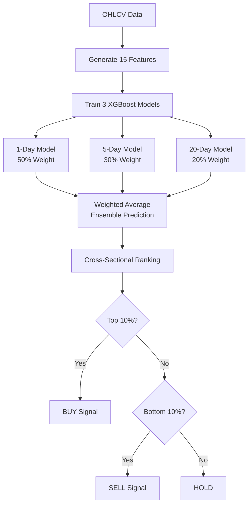
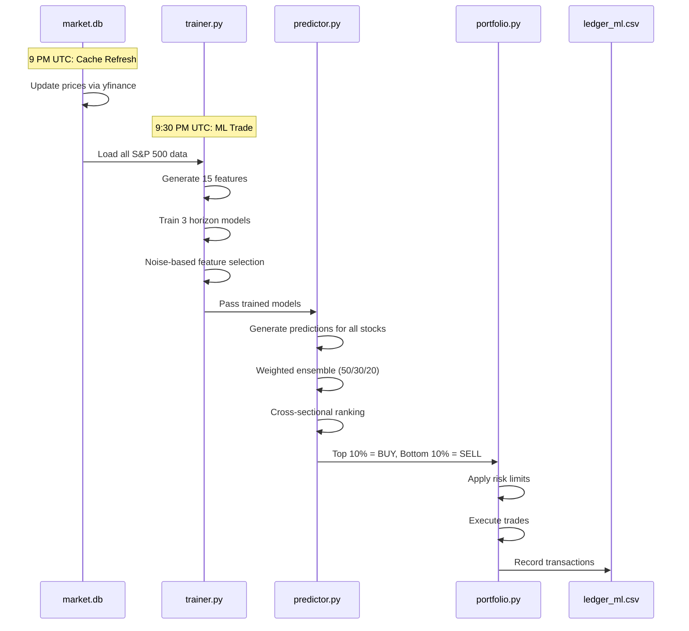
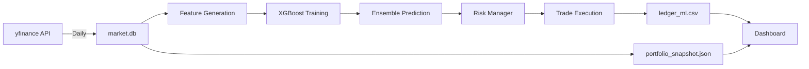

# ML Ensemble Strategy

## Overview

The **experimental ML strategy** uses a multi-horizon XGBoost ensemble to predict stock returns and generate daily trading signals.

Based on quantitative finance research combining technical analysis with machine learning.

---

## 📊 Performance (Updated Dec 2025)

### Point-in-Time Backtest (Oct 1 - Dec 17, 2025)

| Metric | ML Ensemble |
|--------|-------------|
| **Final Value** | $10,764 (from $10k) |

| **Annualized Return** | +43.8% |
| **Sharpe Ratio** | 1.37 |
| **Max Drawdown** | -16.5% |
| **Win Rate** | 56.9% |
| **Alpha vs SPY** | +4.54% |

### Walk-Forward Validation (2017-2025)

Full 8-year walk-forward backtest with monthly retraining and weekly rebalancing:

| Metric | ML Strategy |
|--------|-------------|
| **Final Value** | $667,664 (from $100k) |

| **CAGR** | +26.3% |
| **Sharpe Ratio** | 0.84 |
| **Max Drawdown** | -36.7% |
| **Win Rate** | 56.8% |
| **Weeks Traded** | 419 |
| **Tickers Used** | 505 |

> Results from `results/walkforward_fair_comparison.json` using aligned production code.

---

## 🧠 How It Works

### 1. Multi-Horizon Ensemble Architecture



### 2. Feature Engineering (15 Features)

| Category | Features |
|----------|----------|
| **Momentum (4)** | RSI, MACD, MACD_signal, MACD_hist |
| **Trend (5)** | BB_Width, Dist_SMA50, Dist_SMA200, Return_1d, Return_5d |
| **Volume (3)** | OBV_Momentum, Volume_Ratio, VWAP_Dev |
| **Volatility (3)** | ATR_Pct, BB_PctB, Vol_Ratio |

### 3. Noise-Based Feature Selection

```python
# Production feature selection process
1. Add 5 random noise columns to training data
2. Train quick XGBoost model (50 trees)
3. Get feature importances
4. Keep only features with importance > max(noise features)
5. Fallback: if none beat noise, keep top 8 by importance
6. Train final model on selected features only
```

This ensures we only use features that are genuinely predictive.

### 4. Target Calculation (Fixed Dec 2025)

```python
# Correct target calculation for N-day horizon
target = close.pct_change(horizon).shift(-horizon)

# This means:
# - horizon=5: Target is the 5-day return starting from today
# - shift(-5): We can't know tomorrow's 5-day return until 5 days later
```

> **Critical Bug Fix**: Previously used `pct_change().shift(-horizon)` which incorrectly calculated 1-day returns shifted, not N-day returns.

---

## 📉 Daily Trading Flow



---

## ⚙️ Model Parameters

### XGBoost Configuration

```python
xgb_params = {
    'objective': 'reg:squarederror',
    'n_estimators': 100,
    'max_depth': 5,
    'learning_rate': 0.05,
    'min_child_weight': 5,
    'subsample': 0.8,
    'colsample_bytree': 0.8,
    'reg_lambda': 1.0,
    'random_state': 42
}
```

### Ensemble Weights

| Horizon | Weight | Purpose |
|---------|--------|---------|
| 1-day | 50% | Short-term momentum capture |
| 5-day | 30% | Weekly trend following |
| 20-day | 20% | Monthly direction filter |

### Trading Rules

| Parameter | Value |
|-----------|-------|
| Universe | S&P 500 (~503 stocks) |
| Buy Threshold | Top 10% by prediction |
| Sell Threshold | Bottom 10% by prediction |
| Rebalance | Daily (weekdays) |
| Retrain | Daily |

---

## 🛡️ Risk Management

| Control | Setting |
|---------|---------|
| **Stop-Loss** | 15% from entry price |
| **Max Position** | 15% of portfolio |
| **Max Sector** | 30% of portfolio |
| **Drawdown Warning** | -15% → reduce sizes 50% |
| **Drawdown Halt** | -20% → no new buys |
| **Drawdown Liquidate** | -25% → force sell 50% |

---

## 📁 Files

| File | Purpose |
|------|---------|
| `src/models/trainer.py` | Model training + feature selection |
| `src/models/predictor.py` | Ensemble predictions |
| `src/features/indicators.py` | Technical feature generation |
| `config/settings.yaml` | Risk settings |
| `ledger_ml.csv` | Trade history |
| `.github/workflows/ml_trade.yml` | Daily automation |

---

## 🔧 Configuration

Edit `config/settings.yaml`:

```yaml
model:
  training_period: "max"    # Use all available data
  retrain_daily: true       # Retrain every run

risk:
  stop_loss_pct: 0.15       # 15% stop-loss
  max_position_pct: 0.15    # Max 15% per stock
  max_sector_pct: 0.30      # Max 30% per sector
  drawdown_warning: 0.15    # Reduce at -15%
  drawdown_halt: 0.20       # Stop at -20%
```

---

## 📈 Usage

### Command Line
```bash
# Run ML strategy with isolated portfolio
python main.py --strategy ml --portfolio ml

# Train model only (no trading)
python main.py --mode train --strategy ml

# Backtest
python scripts/backtests/ml_walkforward.py
```

### GitHub Actions
1. Go to **Actions** tab
2. Select **"ML Strategy Trade"**
3. Click **"Run workflow"**

---

## 🕐 Workflow Schedule

| Workflow | Schedule | Action |
|----------|----------|--------|
| **ML Strategy Trade** | Mon-Fri, 9:30 PM UTC | Daily retraining + trading |

The workflow:
1. Loads cached market data
2. Generates features for all S&P 500 stocks
3. Trains 3 XGBoost models (1d, 5d, 20d horizons)
4. Generates weighted ensemble predictions
5. Executes trades based on cross-sectional ranking
6. Commits updated ledger to repo

---

## 🐛 Bug Fixes (Dec 2025)

### 1. Target Calculation Bug
**Problem**: `pct_change().shift(-horizon)` calculated 1-day returns shifted, not N-day returns.

**Fix**: Changed to `pct_change(horizon).shift(-horizon)` for proper N-day return prediction.

### 2. Feature Selection Order
**Problem**: Feature selection happened after training, not before.

**Fix**: Now uses quick model for selection, then trains final model on selected features only.

### 3. Random Seed
**Problem**: `np.random.seed(None)` caused irreproducible results.

**Fix**: Fixed seed to `42` for reproducibility.

---

## 📊 Comparison with Momentum

| Metric | ML Ensemble | Momentum |
|--------|-------------|----------|
| **Rebalance** | Daily | Monthly |
| **Model Type** | XGBoost ML | Rules-based |
| **Features** | 15 technical | 12-1 momentum only |
| **Training** | Daily retrain | None |
| **Complexity** | High | Low |
| **Sharpe** | 1.37 | 0.98 |

---

## 🔗 Data Flow



---

## 📚 Theory

### Why Multi-Horizon?
Different trading signals have different time scales:
- **1-day**: Captures mean reversion and overnight momentum
- **5-day**: Captures weekly trends and sector rotation
- **20-day**: Filters out noise, captures sustained moves

### Why Cross-Sectional Ranking?
Instead of predicting absolute returns (hard), we predict relative performance (easier):
- "AAPL will beat MSFT this week" is more predictable than "AAPL will return 2.3%"
- Cross-sectional ranking normalizes for market conditions

### Why Noise-Based Feature Selection?
- Features that don't beat random noise are hurting the model
- Dynamic selection adapts to changing market regimes
- Prevents overfitting to spurious correlations

---

## Live Dashboard

View real-time ML portfolio performance at: **[paper-trader-ai.streamlit.app](https://paper-trader-ai.streamlit.app/)**

The dashboard shows:
- Current ML portfolio value vs SPY benchmark
- Performance chart with daily values
- Current holdings and recent trades
