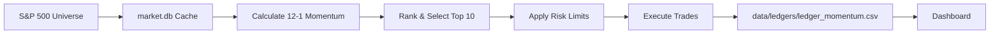

# Momentum Strategy

## Overview

The **primary production strategy** using 12-month momentum factor with 15% daily stop-loss.

Based on academic research by Jegadeesh & Titman (1993) and Fama-French factor investing.

---

##  Performance (Updated Dec 2025)

### Full Backtest (2015-2025, Monthly Rebalancing)

| Metric | Momentum Strategy |
|--------|-------------------|
| **Final Value** | $119,934 (from $10k) |

| **CAGR** | +25.6% |
| **Sharpe Ratio** | 0.98 |
| **Max Drawdown** | -27.2% |
| **Stop-Loss Triggers** | 65 |

### Yearly Returns

| Year | Return | Notes |
|------|--------|-------|
| 2015 | +18.4% |  |
| 2016 | -5.7% | Only losing year |
| 2017 | +42.6% | Strong tech rally |
| 2018 | +19.5% |  |
| 2019 | +16.1% |  |
| 2020 | +0.9% | COVID volatility |
| 2021 | +31.7% | Recovery rally |
| 2022 | +10.2% | Beat market in down year |
| 2023 | +21.4% |  |
| 2024 | +136.0% | NVDA/AI boom |
| 2025 | +29.5% | YTD |

### Rebalance Frequency Comparison

| Metric | Monthly | Weekly |
|--------|---------|--------|
| CAGR | **+25.6%** | -0.3% |
| Sharpe | **0.98** | 0.01 |
| Max DD | **-27%** | -28% |

>  Weekly rebalancing fails due to stop-losses triggering on short-term volatility.

---

##  Top Holdings Over Time

The strategy naturally concentrates in high-momentum stocks:

| Ticker | % of Periods Held | Notes |
|--------|-------------------|-------|
| NVDA | 44% | AI/GPU boom 2023-2024 |
| AMD | 27% | Semiconductor momentum |
| TPL | 26% | Energy/land play |
| BLDR | 21% | Homebuilder momentum |
| TTD | 20% | Ad-tech growth |
| AXON | 17% | Law enforcement tech |
| SMCI | 16% | AI infrastructure |
| NFLX | 15% | Streaming rebound |

---

## How It Works

### 1. Stock Selection (Monthly)
```
1. Calculate 12-month return for each S&P 500 stock
   (excluding last month to avoid short-term reversal)
2. Rank all stocks by momentum
3. Select top 10 stocks
4. Equal-weight allocation (~10% each)
```

### 2. Risk Management (Daily)

| Control | Setting |
|---------|---------|
| **Stop-Loss** | 15% from entry price |
| **Max Position** | 15% of portfolio |
| **Max Sector** | 30% of portfolio |
| **Drawdown Warning** | -15% → reduce sizes 50% |
| **Drawdown Halt** | -20% → no new buys |
| **Drawdown Liquidate** | -25% → force sell 50% |

---

## Configuration

Edit `config/settings.yaml`:

```yaml
risk:
  stop_loss_pct: 0.15       # 15% stop-loss
  max_position_pct: 0.15    # Max 15% per stock
  max_sector_pct: 0.30      # Max 30% per sector
  drawdown_warning: 0.15    # Reduce at -15%
  drawdown_halt: 0.20       # Stop at -20%
  drawdown_liquidate: 0.25  # Liquidate at -25%
```

---

## Usage

### Command Line
```bash
# Run momentum strategy with isolated portfolio
python main.py --strategy momentum --portfolio momentum
```

### GitHub Actions
1. Go to **Actions** tab
2. Select **"Momentum Strategy Trade"**
3. Click **"Run workflow"**

---

## Workflow Schedule

| Workflow | Schedule | Action |
|----------|----------|--------|
| **Momentum Strategy Trade** | 1st-3rd of month, 9:30 PM UTC | Monthly rebalance |

The workflow runs on days 1-3 to catch the first trading day regardless of weekends/holidays.

---

## Files

| File | Purpose |
|------|---------|
| `src/strategies/momentum_strategy.py` | Strategy implementation |
| `config/settings.yaml` | Risk configuration |
| `data/ledgers/ledger_momentum.csv` | Trade history |
| `.github/workflows/momentum_trade.yml` | Automation |
| `scripts/validation/momentum_rebalance_comparison.py` | Backtest comparison |

---

## Data Flow



---

## Dual Portfolio Integration

This strategy runs independently alongside the ML strategy:

| Portfolio | Strategy | Ledger |
|-----------|----------|--------|
| Momentum | This strategy | `data/ledgers/ledger_momentum.csv` |
| ML | XGBoost ensemble | `data/ledgers/ledger_ml.csv` |

### Live Dashboard
View real-time comparison at: **[paper-trader-ai.streamlit.app](https://paper-trader-ai.streamlit.app/)**
